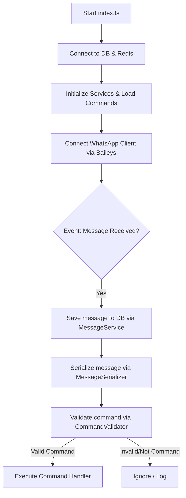

# BotWA

A feature-rich, high-performance WhatsApp Bot built with TypeScript, Baileys, Prisma, and Redis.

## Features

- **TypeScript Core**: Robust, strongly-typed codebase for reliability and ease of maintenance.
- **WhatsApp Web API Integration**: Powered by `@whiskeysockets/baileys` for seamless WhatsApp communication.
- **Database & Persistence**: Integration with PostgreSQL via Prisma ORM.
- **Caching**: Memory and Redis-based caching layers for rapid data retrieval and improved performance.
- **Code Quality**: Linted and formatted using Biome.
- **Testing**: Built-in test suite powered by Vitest.

---

## Folder Structure

Below is an overview of the BotWA repository structure:

```
BotWA/
├── prisma/                 # Database schema configuration
│   └── schema.prisma       # Prisma DB schema definition
├── src/                    # Bot source code
│   ├── commands/           # Bot commands divided by category
│   │   ├── info/           # Informational commands (e.g., ping)
│   │   └── owner/          # Owner/admin-only management commands
│   ├── core/               # Critical system engines and bootstrappers
│   │   ├── auth/           # Baileys authentication state helpers
│   │   ├── cache/          # Cache implementations (Redis & memory)
│   │   ├── client/         # Core WhatsApp client wrapper and lifecycle management
│   │   ├── commands/       # Dynamic filesystem command loader
│   │   ├── database/       # DB clients (Prisma and Redis database connections)
│   │   └── logger/         # Logging configuration using Pino
│   ├── events/             # WhatsApp event dispatch handlers
│   │   └── message/        # Message parsing, serialization, validation, and handler
│   ├── services/           # Data access and business logic services
│   │   ├── group.service.ts   # Group configuration and metadata service
│   │   ├── message.service.ts # Incoming/outgoing message storage service
│   │   └── user.service.ts    # User state, ban, limit, and settings service
│   ├── shared/             # Shared configurations, types, translations, and utilities
│   │   ├── config/         # System settings and parsed env validations (Zod)
│   │   ├── locales/        # Localization files (Indonesian, English)
│   │   ├── types/          # Shared TypeScript type definitions
│   │   └── utils/          # Formatting and helper utilities
│   └── index.ts            # Entry point for bootstrapping the application
├── config.json             # Bot configurations (names, owners, prefix, etc.)
└── package.json            # NPM dependencies and script definitions
```

---

## Bot Execution Flow

The bot processes events and messages in the following order:



1. **Bootstrapping**:
   `src/index.ts` initializes the database connection, Redis cache client, services (User, Group, Message), and dynamic command loader (`FileLoader`) which loads all TypeScript files from the `./src/commands` folder.
2. **WhatsApp Authentication & Connection**:
   The bot establishes a session using `@whiskeysockets/baileys`, displaying authentication progress in the logs.
3. **Message Ingestion**:
   When a new message is received, the `messages.upsert` event triggers.
4. **Persistence & Serialization**:
   - The message payload is saved to the PostgreSQL database for logging.
   - The message is normalized and parsed into a clean JSON structure by `MessageSerializer`.
5. **Validation & Routing**:
   - `CommandValidator` parses the message text against the prefix configurations (e.g., `!`, `/`).
   - If a valid command signature is found, the system routes the request to the matching command script in `src/commands` and executes its logic.

---

## Prerequisites

Ensure you have the following installed:

- **Node.js** (v22 or higher)
- **pnpm** (preferred package manager)
- **Redis Server** (for caching)
- **PostgreSQL** (for persistent storage)

## Installation

1. Clone the repository and navigate inside:
   ```bash
   cd botwa
   ```

2. Run the installation script or install manually:
   ```bash
   pnpm install
   cp .env.example .env
   ```

3. Update your database configuration and Redis connection details in `.env` and bot settings in `config.json`.

4. Sync database schema:
   ```bash
   pnpm prisma db push
   ```

## Usage

### Development Mode
```bash
pnpm dev
```

### Production Mode
```bash
pnpm build
pnpm start
```

### Formatting and Linting
```bash
pnpm lint
pnpm format
```

### Testing
```bash
pnpm test
```

## License

This project is licensed under the MIT License.
